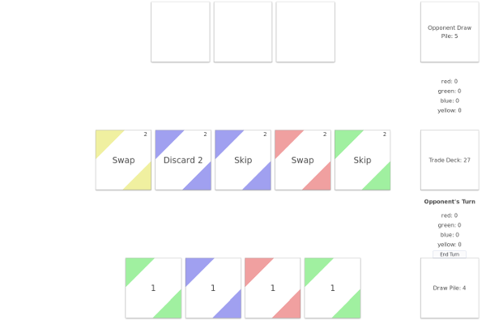

# Digital Deck Builder

A two-player platform for playing deck building card games.



## Requirements

- Python 3.6
- Pipenv
- Node 8.10
- Npm

## Install

```bash
# Install dependencies
pipenv install
npm install

# Build and run
npm run build
pipenv shell
python ddb.py
```

Open `localhost:5000` in two browser tabs and select a game.
